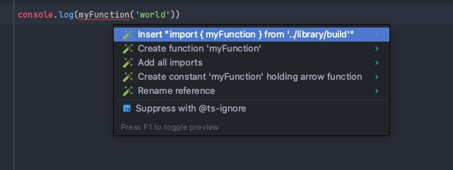

This is a demo project to describe the issue from this link: https://youtrack.jetbrains.com/issue/WEB-62884

1. open the `library` folder in one IDE window
2. open the `project` folder in another IDE window
3. `$ npm install` in `library`
4. copy the `library/package.json` in `library/build/package.json`
5. `$ npm link` in `library/build`
6. `$ npm link library` in `project`
7. `$ npm install` in `project`
. 
**Issue 1:**
Try to open the definition for `myFunction`. Notice how the cursor jumps to the import statement instead of jumping directly to the .ts file

**Issue 2:**
Try to remove the import from `project/index.ts` and use the IDE to import it again. Notice the weird import statement: `import { myFunction } from '../library/build'`. It should be just `library`:

